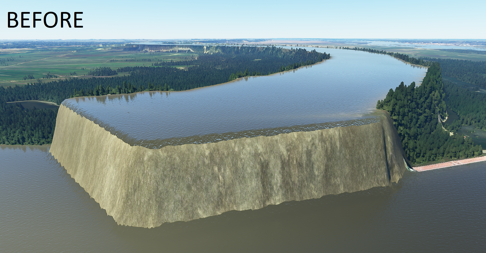
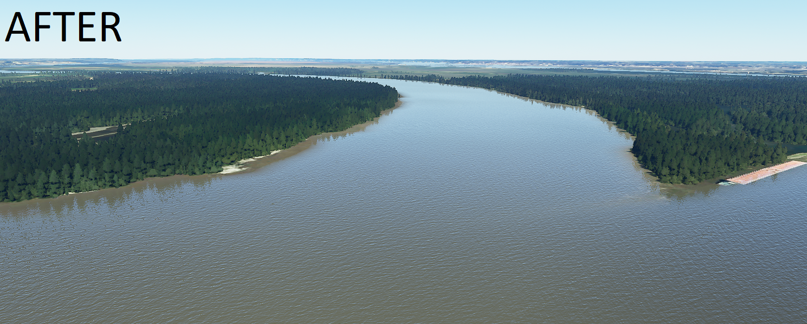

# MSFS 2020 Missouri River Terrain Height Fix
Terrain fixes for Microsoft Flight Simulator 2020 for the Missouri River in Missouri, United States

## Let's bring it down a notch, shall we?
In the default MSFS scenery, the Missouri River is more than 100 feet above surrounding terrain. This package contains terraform adjustments to lower it to more realistic levels. All 350+ miles of the river between Kansas City and St. Louis have been checked, ensuring bridges and other features are preserved.

#  Installation
* Visit the releases section of this GitHub repo
* Grab the latest zip archive
* Unzip the file to your MSFS Community folder
* Launch MSFS2020 and enjoy the river in it's new, non-aquaduct form! :)
